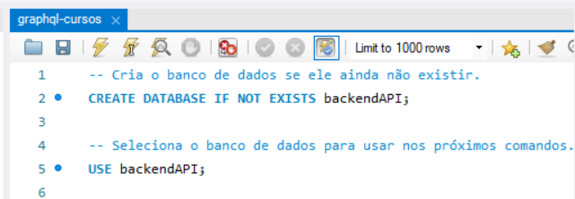
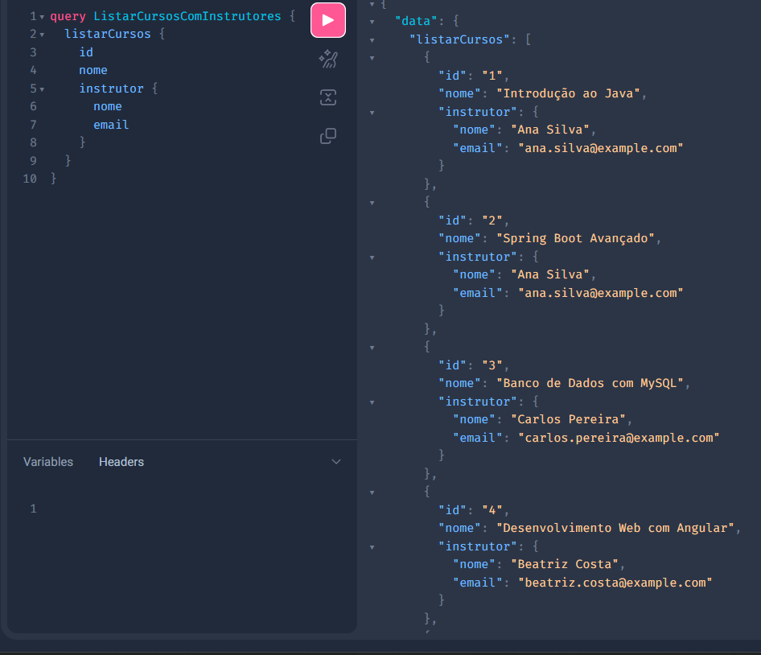
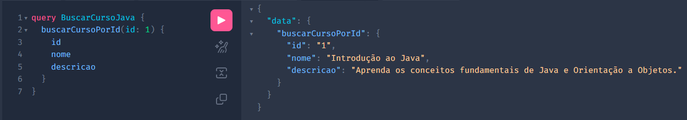

# API GraphQL para Gerenciamento de Cursos

Este projeto foi desenvolvido como parte da avaliação bimestral, com o objetivo de criar uma API utilizando **Spring Boot** e **GraphQL**. A API foca na entidade `Curso` e permite a consulta de cursos e seus respectivos instrutores, com integração a um banco de dados MySQL.

## 🚀 Tecnologias Utilizadas

-   **Java 17**
-   **Spring Boot 3**
-   **Spring for GraphQL**
-   **Spring Data JPA**
-   **MySQL**
-   **Apache Maven**

---

## 📋 Pré-requisitos

Antes de iniciar, garanta que você tenha os seguintes softwares instalados em seu ambiente de desenvolvimento:

1.  **Java Development Kit (JDK)** - Versão 17 ou superior.
2.  **Apache Maven** - Para gerenciamento de dependências e build do projeto.
3.  **Servidor MySQL** - É essencial que um servidor MySQL esteja instalado e em execução.
4.  **Cliente SQL (Opcional)** - Ferramentas como MySQL Workbench, DBeaver ou SQuirreL SQL facilitam a criação e verificação do banco de dados.

---

## 🛠️ Como Executar o Projeto

Siga os passos abaixo para configurar e executar a aplicação localmente.

### 1. Clone o Repositório

Primeiramente, clone o repositório do projeto para sua máquina local.

```bash
git clone https://github.com/Caua-Moreto/graphql-cursos-api
cd https://github.com/Caua-Moreto/graphql-cursos-api
```

### 2. Configure o Banco de Dados

A aplicação precisa se conectar a um banco de dados (schema) chamado `backendAPI`. Usando seu cliente SQL de preferência, execute o comando para criar o banco de dados.



### 3. Verifique a Configuração de Conexão

Abra o arquivo de configuração localizado em `src/main/resources/application.properties`. Verifique se as credenciais de acesso (`username` e `password`) correspondem às do seu servidor MySQL.

```
spring.datasource.url=jdbc:mysql://localhost:3306/backendAPI

# Usuário e senha do banco de dados
spring.datasource.username=root
spring.datasource.password=1234@mudar
```

### 4. Execute a Aplicação

Abra um terminal na raiz do projeto e execute o comando `mvn spring-boot:run` para iniciar a aplicação ou inicie o programa a partir da classe principal, `GraphqlCursosApiApplication.java`.

---

## 🧪 Testando a API

Com a aplicação em execução, você pode testar as queries GraphQL usando a interface **GraphiQL**, que já vem habilitada.

1.  Abra seu navegador e acesse a URL: [**http://localhost:8080/graphiql**](http://localhost:8080/graphiql)

2.  Você pode utilizar as queries de exemplo para testar a API.

#### **Exemplo 1: Listar todos os cursos e seus instrutores**



#### **Exemplo 2: Buscar um curso específico por ID**

Use a query para buscar um curso específico pelo seu ID. Lembre-se de substituir o valor do ID por um que exista no seu banco de dados.



---

## ✅ Atendimento aos Critérios de Avaliação

Este projeto foi desenvolvido para atender rigorosamente aos seguintes critérios:

### **Critério 1: Especificação do tipo da entidade no schema GraphQL**

-   **Status:** `Atendido`
-   **Análise:** O tipo `Curso` foi definido no arquivo `src/main/resources/graphql/schema.graphqls`, refletindo fielmente os atributos da entidade, incluindo seu relacionamento com o tipo `Instrutor`.

### **Critério 2: Especificação de Query para a entidade no schema GraphQL**

-   **Status:** `Atendido`
-   **Análise:** O `type Query` no `schema.graphqls` especifica as queries `listarCursos` e `buscarCursoPorId`, que permitem a consulta de dados da entidade `Curso`.

### **Critério 3: Implementação de classe Java para consulta com a query definida**

-   **Status:** `Atendido`
-   **Análise:** A classe `CursoGraphQLController.java` utiliza a anotação `@QueryMapping` para mapear os métodos Java às queries do schema. Esses métodos, por sua vez, utilizam o `CursoRepository` para acessar os dados, servindo como a camada de serviço de consulta.

### **Critério 4: API integrada com o banco de dados do projeto**

-   **Status:** `Atendido`
-   **Análise:** A aplicação está configurada no arquivo `application.properties` para se conectar a um banco de dados MySQL. O uso do Spring Data JPA (`CursoRepository`) garante a integração persistente e funcional com o banco de dados, conforme o requisito.
